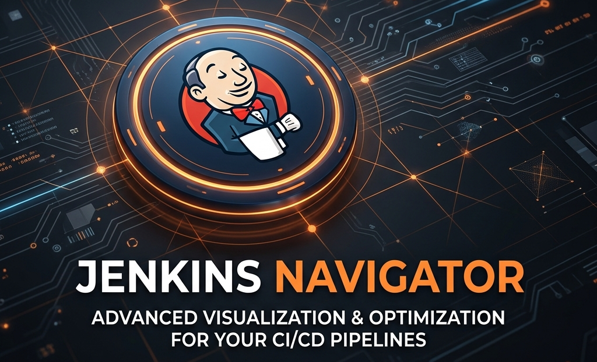

<p align="center">
  
</p>

<h1 align="center">🧭 Jenkins Navigator</h1>

<p align="center">
  <a href="https://ajaygangwar945.github.io/Jenkins-Navigator/">
    </a>
  
  
  
  
  
  <br />
  
</p>

**Jenkins Navigator** is a premium, single-page interactive guide and reference application designed for DevOps engineers and developers. 

---

## 🚀 View Live Site

The project is live and accessible online.

<a href="https://ajaygangwar945.github.io/Jenkins-Navigator/">
    </a>

---

## 🛠 Features

- **🌐 Interactive Architecture Model**: Clear breakdown of Master Node, Agent Nodes, Executors, Jobs, Queues, and Workspaces.
- **🔄 Visual Pipeline Flow**: Stage diagram detailing SCM, Build, Test, Package, and Deploy with an inline annotated `Jenkinsfile` reference.
- **🧩 Plugin Directory**: Grouped overview of ecosystem integrations across Source Control, Build Tools, Testing/QA, and Operations.
- **🔒 Security Guide**: High-fidelity walkthrough of Authentication, Credentials Management, Role-Based Access Control, and Script sandboxing.
- **💻 Key Commands Console**: Curated command listings for installation, service management, CLI operations, and Groovy scripts—featuring container scroll responsiveness on mobile viewports.

---

## 🚀 Quick Start

### Running Locally (Direct HTML)

Since the project is a standalone, client-side application, you can run it directly:

1. **Direct Open**: Double-click `index.html` (or drag and drop it into any modern web browser).
2. **Local Dev Server**: Alternatively, serve it locally using NPM or VS Code Live Server extension:
   ```bash
   npx serve .
   # or
   python -m http.server 8000
   ```

### Running Locally (Docker Container)

To run the application inside an isolated Nginx container:

1. **Build the Docker image**:
   ```bash
   docker build -t jenkins-navigator:latest .
   ```

2. **Run the container**:
   ```bash
   docker run -d -p 8080:80 --name jenkins-navigator-app jenkins-navigator:latest
   ```

3. **Access the application**:
   Open your browser and navigate to `http://localhost:8080`.

---

## 📁 Repository Structure

- `index.html`: Main interactive Single-Page Application (HTML, custom Vanilla CSS, and JavaScript).
- `Dockerfile`: Production Nginx Alpine config to serve the static content.
- `Jenkinsfile`: Declarative pipeline specifying validation, Docker builds, testing, and push stages.
- `.gitignore`: Excludes local environments, logs, and workspace IDE caches.
- `.dockerignore`: Excludes build dependencies and repository metadata from the docker context.
- `banner.png`: Custom banner image (height 200px).

---

## 🤝 Contributing & Support

Contributions, issues, and feature requests are welcome! Feel free to check the [issues page](https://github.com/ajaygangwar945/Jenkins-Navigator/issues) to submit feedback or bug reports.

If this project helped you navigate Jenkins pipeline structures and configurations, please give it a ⭐️!

---

*Designed and developed with 🧡 for the DevOps community.*

